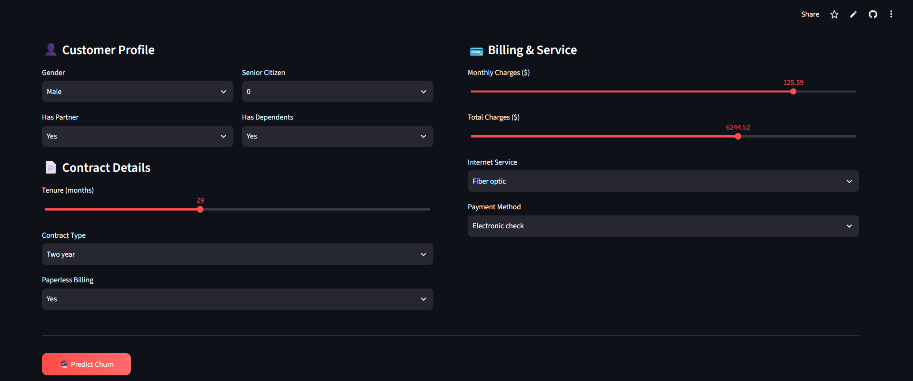
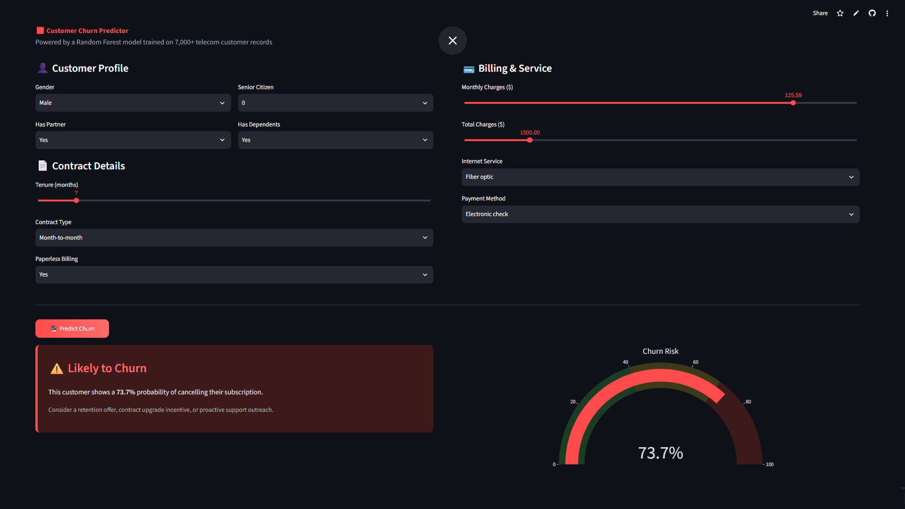
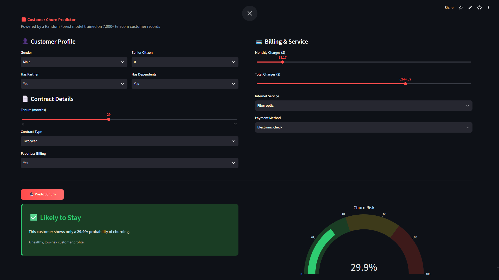

# 📊 Customer Churn Prediction & Analytics

[](https://www.python.org/)
[](https://scikit-learn.org/)
[](https://streamlit.io/)
[](LICENSE)

A machine learning pipeline that predicts whether a telecom customer will cancel their subscription, paired with an interactive Streamlit app for real-time, single-customer churn prediction.

**🔗 View Live Demo: https://customer-churn-prediction-analysis-pkr05.streamlit.app/

---

## 📌 Executive Summary

Customer acquisition typically costs more than retention, so predicting *who* is about to churn — and *why* — lets a business intervene before losing the customer. This project trains and compares two classification models on 7,000+ telecom customer records, then wraps the better-performing model in a live prediction tool.

### Key Outcomes
- **Random Forest outperformed Logistic Regression** across accuracy, precision, F1, and ROC-AUC.
- **Top churn drivers identified**: Contract type, tenure, total charges, and monthly charges — together explaining the majority of the model's predictive power.
- Delivered as an interactive web app where inputting a customer's profile returns a live churn probability.

---

## 🛠️ Tech Stack

| Layer | Tools |
| :--- | :--- |
| **Language** | Python 3.10+ |
| **Data Processing** | pandas, numpy |
| **Modeling** | scikit-learn (Logistic Regression, Random Forest) |
| **Visualization** | matplotlib, seaborn, plotly |
| **Web App** | Streamlit |
| **Model Persistence** | joblib |

---

## 📁 Project Structure

```text
customer-churn-prediction/
│
├── data/
│   └── telco_churn.csv        # Raw Telco Customer Churn dataset (7,043 records)
│
├── models/
│   ├── churn_model.pkl         # Trained Random Forest model
│   ├── scaler.pkl              # StandardScaler used on numeric features
│   ├── encoders.pkl            # LabelEncoders for categorical columns
│   ├── columns.pkl             # Expected feature column order
│   ├── feature_importance.png  # Top 10 churn-driving features
│   └── confusion_matrix.png    # Random Forest confusion matrix
│
├── train_model.py              # Cleans data, trains & compares both models
├── app.py                      # Interactive Streamlit churn predictor
├── requirements.txt
├── .gitignore
└── README.md
```

---

## 📊 Dataset Overview

The **Telco Customer Churn** dataset from Kaggle — **7,043 customer records**, 21 features.

| Feature Category | Columns | Description |
| :--- | :--- | :--- |
| **Demographics** | `gender`, `SeniorCitizen`, `Partner`, `Dependents` | Basic customer attributes |
| **Services** | `PhoneService`, `InternetService`, `OnlineSecurity`, `TechSupport`, `StreamingTV`, etc. | Subscribed add-ons |
| **Account Info** | `tenure`, `Contract`, `PaperlessBilling`, `PaymentMethod`, `MonthlyCharges`, `TotalCharges` | Billing & contract terms |
| **Target** | `Churn` | Yes / No — whether the customer left |

---

## 📈 Model Performance

Both models were trained on an 80/20 stratified train-test split, with class balancing applied to handle the ~26% churn rate.

| Model | Accuracy | Precision | Recall | F1-Score | ROC-AUC |
| :--- | :---: | :---: | :---: | :---: | :---: |
| Logistic Regression | 74.0% | 0.506 | **0.797** | 0.619 | 0.758 |
| **Random Forest (selected)** | **75.9%** | **0.531** | 0.786 | **0.634** | **0.767** |

**Random Forest** was selected as the production model — it's saved and loaded directly by `app.py`.

---

## 💡 Top Churn Drivers

```text
Feature Importance (Random Forest)
+-------------------+------------+
| Feature           | Importance |
+-------------------+------------+
| Contract          | 21.7%      |
| tenure            | 14.2%      |
| TotalCharges       | 11.2%      |
| MonthlyCharges     | 10.7%      |
| OnlineSecurity     | 9.8%       |
| TechSupport        | 7.9%       |
+-------------------+------------+
```

**Interpretation**: Customers on **month-to-month contracts** with **short tenure** are by far the highest churn risk — contract type alone accounts for over a fifth of the model's decision-making.

---

## 🚀 Dashboard Features

- **Interactive input form** — set gender, contract type, tenure, monthly/total charges, internet service, payment method, and more.
- **Live prediction** — click "Predict Churn" to get an instant classification.
- **Probability gauge chart** — visual, color-coded churn risk meter (Plotly).
- **Styled result cards** — red alert card for high churn risk, green card for low risk, both with a plain-language recommendation.

---

## 💻 Getting Started

### Prerequisites
- Python 3.10+
- Git

### Local Setup

```bash
git clone https://github.com/PratyushRaj0512/Customer-Churn-Prediction-Analysis.git
cd Customer-Churn-Prediction-Analysis

python -m venv venv
# Windows:
venv\Scripts\activate
# macOS/Linux:
source venv/bin/activate

pip install -r requirements.txt
streamlit run app.py
```

Open `http://localhost:8501` in your browser.

**To retrain the model from scratch:**
```bash
python train_model.py
```

---

## 📸 Screenshots

**Churn Predictor — Input Form**


**Prediction Result — High Churn Risk**


**Prediction Result — Low Churn Risk**


---

## 🗺️ Future Improvements

- [ ] Add SHAP-based explainability for individual predictions.
- [ ] Try gradient boosting models (XGBoost/LightGBM) for comparison.
- [ ] Deploy a batch-prediction mode (upload a CSV, get churn scores for all rows).

---

## 📄 License

Distributed under the MIT License.